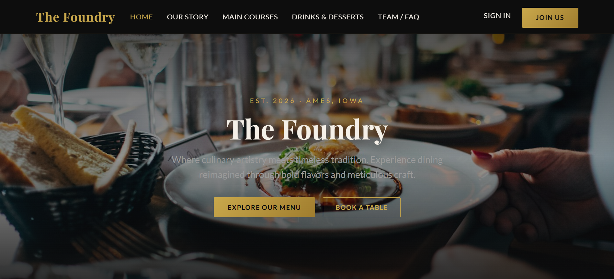

# The Foundry 🍽️

A full-stack restaurant web application with menu browsing, reservations, online ordering, reviews, and an admin dashboard, built with React, Node.js/Express, and MongoDB.

Built as a two-person final project for SE/COM S 3190 at Iowa State University, Spring 2026.



## Tech Stack

- **Frontend:** React, React Router, Vite, Axios, Bootstrap
- **Backend:** Node.js, Express, Mongoose, express-validator
- **Database:** MongoDB
- **Auth:** JSON Web Tokens (JWT), bcrypt password hashing, role-based access control (customer / admin)

## Features

- Menu browsing with category and dietary filters, plus dish detail pages with ingredients, allergens, and reviews
- Book, edit, and cancel reservations; add items to a cart and place orders
- JWT authentication with protected routes and automatic logout when a token expires
- Admin dashboard with full CRUD for menu items and reservations, plus review moderation
- Client-side form validation and server-side validation with express-validator
- Custom 404 and 403 pages and user-friendly API error states

## My Contributions (Grayson Burton)

- **Pages:** My Reservations & Orders, Menu (Drinks & Desserts) with dietary filtering, Our Story / Gallery, and Team Info / FAQ
- **Backend:** Reservation and order REST API routes with express-validator input validation
- **Frontend auth:** Authentication context for login, signup, and session state; protected routes; token-expiration handling

Teammate: Joshua Reis (Home page, main menu, dish details, admin dashboard, backend auth, and menu/review APIs)

## Running Locally

**Prerequisites:** Node.js 18+ and MongoDB (local install or a MongoDB Atlas connection string)

**Backend**
```bash
cd backend
npm install
cp .env.example .env   # then edit the values
npm run seed           # loads sample menu items and demo accounts
npm run dev            # starts the API on http://localhost:8080
```

**Frontend**
```bash
cd frontend
npm install
npm run dev            # opens on http://localhost:5173
```

The frontend proxies API requests to the backend on port 8080.

## Demo Accounts (created by the seed script)

| Role  | Email                | Password |
|-------|----------------------|----------|
| Admin | admin@thefoundry.com | admin123 |
| User  | john@example.com     | user123  |

## Project Structure

```
backend/
  api/routes/      REST endpoints (auth, menu, reviews, reservations, orders)
  config/          Database connection
  middleware/      JWT authentication and admin-only access control
  models/          Mongoose schemas
  seed/            Sample data
frontend/
  src/pages/       Page components
  src/components/  Navbar, Footer, ProtectedRoute
  src/context/     Auth state
```
